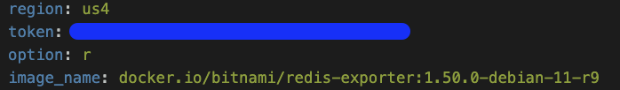
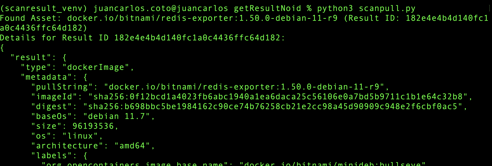

The steps to use this script are very simple:

First make sure to install the required dependencies:

```
pip3 install -r requirements.txt
```

Then, fill the config.yaml file:
```
- Region would be your Sysdig tenant SaaS region *Default region is us-east (us1)
- token: Your Sysdig API token, https://docs.sysdig.com/en/retrieve-the-sysdig-api-token/
- Option, it would be p for pipeline, and r for runtime. *Please notice that for pipeline you may have more than 1 scan results.
- Image name would be the full image name you want to retrieve.
```

Ie, lets say i want to retrieve an scan result for image docker.io/bitnami/redis-exporter:1.50.0-debian-11-r9 from runtime on us4 region.

Fill the config.yaml:



Then just run the script:



